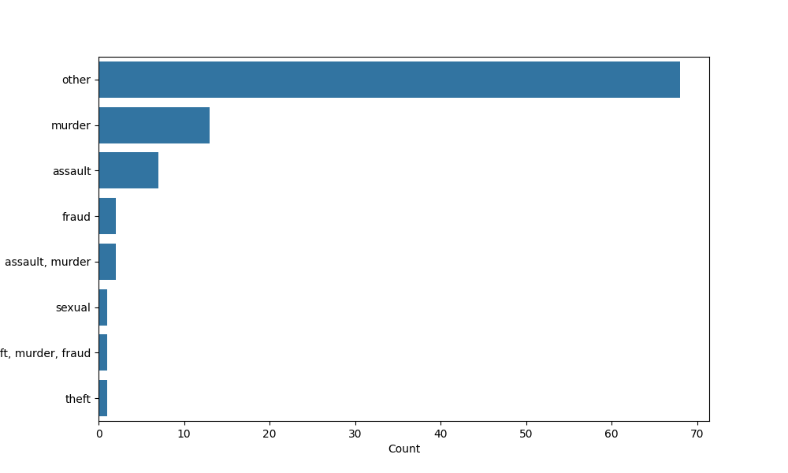
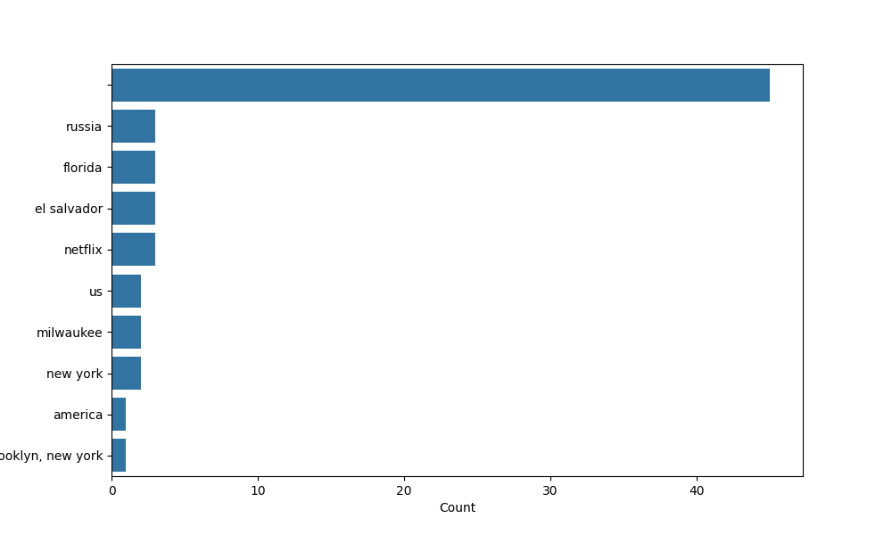
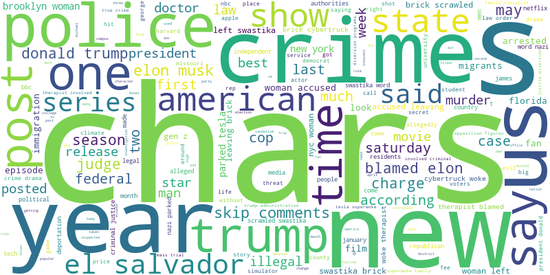
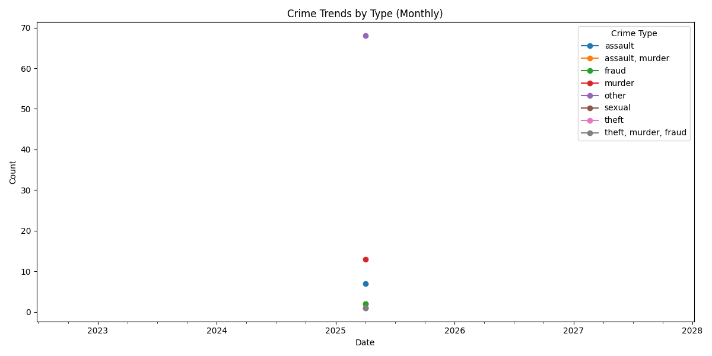

# Crime News Analysis & Visualization

This project automates the process of fetching, analyzing, and visualizing crime-related news articles. It leverages NLP techniques to extract crime types, locations, and trends, and provides interactive dashboards and reports for deeper insights.

---

## Features

- **Automated News Fetching:** Retrieves recent crime news articles using NewsAPI.
- **Text Preprocessing:** Cleans and prepares news text for analysis.
- **Named Entity Recognition (NER):** Extracts locations and crime-related entities using spaCy.
- **Crime Classification:** Categorizes news articles into crime types using keyword-based classification.
- **Geocoding:** Maps extracted locations to latitude and longitude.
- **Trend & Keyword Analysis:** Generates word clouds and trend plots.
- **Report Generation:** Produces Markdown and PDF reports with visualizations.
- **Interactive Dashboard:** Explore data and visualizations via a Streamlit web app.

---

## Example Visualizations

### Crime Type Distribution


### Top Crime Locations


### Crime Keyword Cloud


### Trend Analysis (Weekly)


---

## Directory Structure

```
.
├── data/                   # Input and output data files
├── src/                    # Source code
│   ├── main.py             # Main pipeline script
│   ├── pipeline.py         # (Alternative) Full pipeline and Streamlit app
│   ├── fetch_news.py       # News fetching logic
│   ├── preprocess.py       # Text cleaning and preprocessing
│   ├── ner_extractor.py    # Named Entity Recognition
│   ├── crime_classifier.py # Crime type classification
│   ├── geocode_locations.py# Geocoding logic
│   ├── visualizer.py       # Streamlit dashboard and plotting
│   ├── keyword_cloud.py    # Word cloud generation
│   ├── report_generator.py # Report generation (Markdown, PDF)
│   └── ...                 # Other supporting modules
├── requirements.txt        # Python dependencies
└── README.md               # Project documentation
```

---

## Setup

1. **Clone the repository:**
   ```bash
   git clone <repo-url>
   cd Crime
   ```

2. **Install dependencies:**
   ```bash
   pip install -r requirements.txt
   ```

3. **Download spaCy model and NLTK stopwords:**
   ```bash
   python -m spacy download en_core_web_sm
   python -c "import nltk; nltk.download('stopwords')"
   ```

4. **Set up NewsAPI Key:**
   - The API key is currently hardcoded in `src/fetch_news.py` and `src/pipeline.py` as `API_KEY = 'b515596519fb4396a7c6aad3ff98ab2b'`.
   - For production, replace this with your own key and consider using environment variables for security.

---

## Usage

### 1. Run the Full Pipeline

To fetch news, preprocess, analyze, and generate reports:

```bash
python src/main.py
```

This will:
- Fetch recent crime news
- Clean and preprocess the text
- Extract entities and classify crime types
- Geocode locations
- Generate word clouds and reports
- Save outputs in the `data/` and `reports/` directories

### 2. Launch the Interactive Dashboard

To explore the data and visualizations interactively:

```bash
streamlit run src/visualizer.py
```

or, if using the integrated pipeline/dashboard:

```bash
streamlit run src/pipeline.py
```

Features include:
- Crime type and location distribution
- Keyword cloud
- Downloadable reports (PDF, Markdown)
- Crime heatmaps
- File upload and custom analysis

### 3. Data Files

- `data/raw_news.json`: Raw news articles fetched from NewsAPI
- `data/cleaned_news.csv`: Preprocessed news data
- `data/ner_output.csv`: NER-annotated data with locations and crime types
- `data/geo_news.csv`: Geocoded data with latitude/longitude

### 4. Reports

- Markdown and PDF reports are generated in the `reports/` directory.

---

## Customization

- **Crime Keywords:** Edit `CRIME_KEYWORDS` in `src/main.py` or `src/pipeline.py` to adjust classification.
- **API Key:** Replace the hardcoded NewsAPI key with your own.
- **Visualization:** Modify `src/visualizer.py` for custom dashboard features.

---

## License

[MIT License] (or specify your license here)
